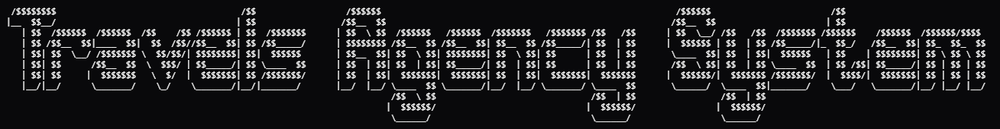
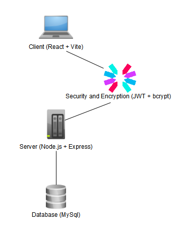
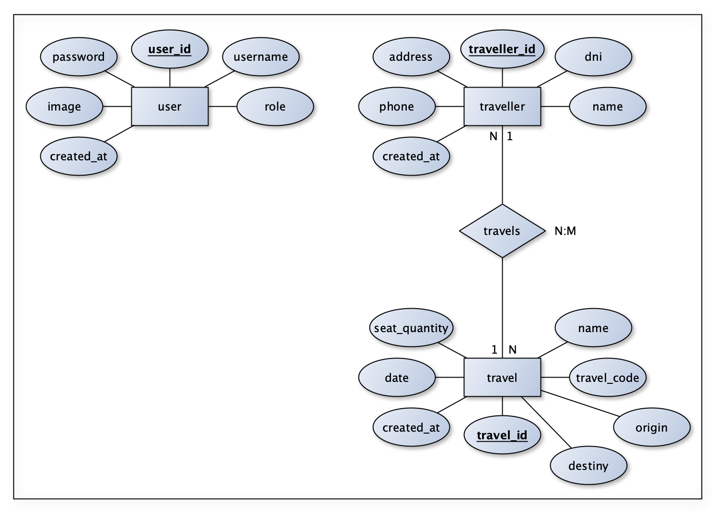
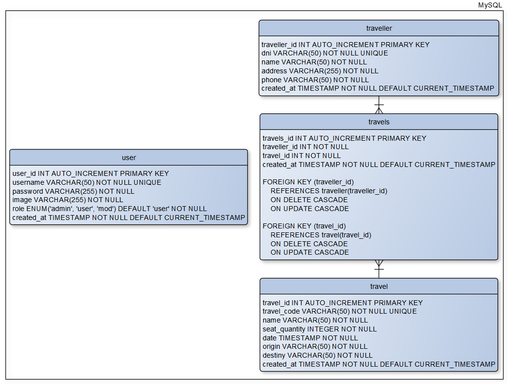

<p align="center">
    
</p>

<p align="center">
    Full-stack travel agency system built with Node.js, Express, MySQL and React.
    The platform includes secure authentication (JWT + bcrypt), role-based access control, and complete CRUD functionality for managing travellers, trips, and related data.
</p>

<p align="center">
    
    
    
    
    
    
    
    
</p>

This repository contains all the necessary components to run the full-stack travel agency system.

> [!NOTE]
> This project was developed for academic purposes.

---

## Quick Start

Follow these steps to run the project using Docker:


#### 1. Clone the repository

```bash
git clone https://github.com/Faiderasp/Travels_agency_system.git
cd Travels_agency_system
```

#### 2. Configure environment variables

Create a `.env` file based on the provided example:

```bash
cp .env.example .env
```

Then edit the `.env` file if needed:

```env
# DATABASE CONFIG
MYSQL_ROOT_PASSWORD=password
MYSQL_DATABASE=database
MYSQL_USER=user
MYSQL_PASSWORD=password
MYSQL_HOST=db
MYSQL_PORT=3306

# JWT CONFIG
JWT_SECRET=your_secret_key
```


#### 3. Run the project with Docker

```bash
docker-compose up --build
```

#### 4. Access the application

- Backend API: http://localhost:3001/api 
- API Documentation (Swagger): http://localhost:3001/docs
- API Health Check: http://localhost:3001/api/health


#### 5. Database initialization

The database is automatically initialized using:

```
./db/init.sql
```

This file contains the schema and initial data.


#### 6. Run the Frontend 

```bash
cd Frontend
npm install
npm run dev
```

#### 7. Stop the containers

```bash
docker-compose down
```

---

### System Architecture

The system follows a three-layer architecture:

1. Presentation Layer (Frontend)
2. Business Logic Layer (Backend API)
3. Data Layer (Database)

<p align="center">
    
</p>

#### Presentation Layer (Frontend)
Built with React. Responsible for user interaction, form handling, and API consumption.

#### Business Logic Layer (Backend)
Developed with Node.js and Express. Handles authentication, authorization, and business rules. Exposes a RESTful API.

#### Data Layer (Database)
Implemented with MySQL. Responsible for data storage, relationships, and integrity constraints.

---

### Technology Choices

- Node.js and Express were chosen for their simplicity and scalability in building RESTful APIs.
- MySQL was selected for its reliability and strong relational data support.
- React was used to create a dynamic and responsive user interface.
- JWT was implemented for stateless and secure authentication.
- bcrypt ensures password security through hashing.

#### Architecture

A three-layer architecture was adopted to separate concerns, improve maintainability, and allow scalability of the system.

---

## Database Documentation

### Entity-Relationship Diagram

<p align="center">
    
</p>

### Relational Diagram

<p align="center">
    
</p>